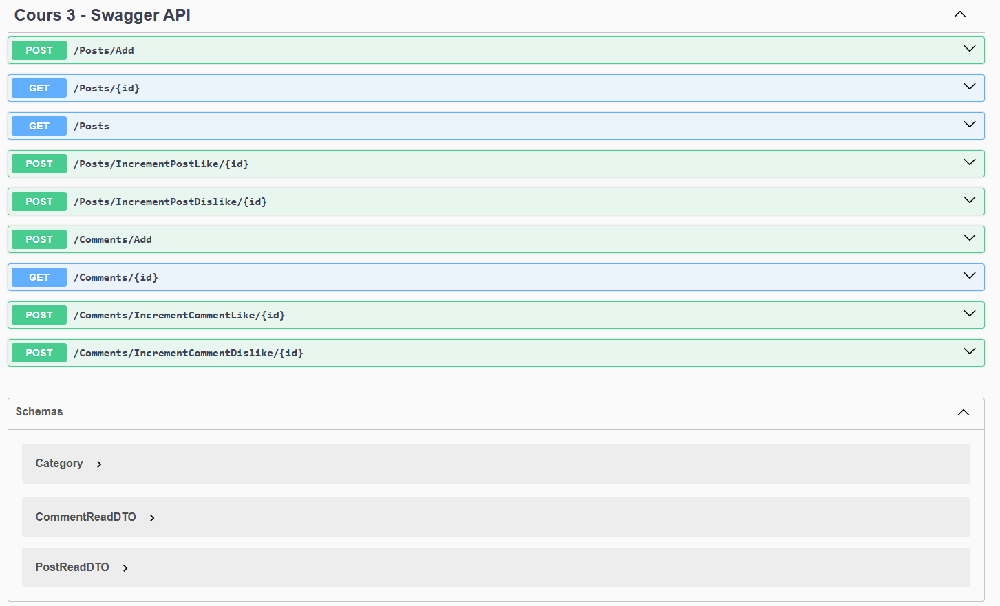

# Projet API avec Blob Storage - TP2 Infonuagique

## Auteurs
- Yanis BERKANE, BERY02010200

## Description
Ce projet implémente une API en utilisant ASP.NET Core avec Entity Framework et un stockage Blob Azure. L'implémentation a été modifiée pour utiliser `BlobController` afin de stocker et récupérer des images dans un `StorageAccount`.

## Modifications apportées

### 1. `Program.cs`
- Ajout du `BlobController` en tant que service injectable.
- Modification des endpoints pour l'ajout et la récupération d'images afin d'utiliser le `BlobController`.
- Gestion des erreurs améliorée pour les différentes routes.
- Intégration de Swagger pour la documentation API.

### 2. `IRepository_mini.cs`
- Ajout des méthodes pour gérer les images stockées sur Blob Storage, notamment :
  - `Task<Results<Created<string>, BadRequest, InternalServerError>> UploadImageToBlob(IFormFile image);`
  - `Task<Results<Ok<string>, NotFound>> GetImageUrl(Guid imageId);`

### 3. `EFRepository_mini.cs`
- Implémentation des nouvelles méthodes définies dans `IRepository_mini.cs`.
- Utilisation de `BlobController` pour interagir avec le Blob Storage.
- Gestion des erreurs et des exceptions pour assurer une meilleure robustesse.

### 4. Gestion des DTO
- Utilisation de DTOs pour minimiser la quantité de données échangées entre les services.
- Ajout de `PostCreateDTO`, `PostReadDTO`, `CommentReadDTO` pour ne transmettre que les informations essentielles.
